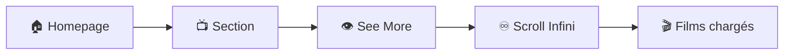

<div align="center">


### *L'interface ultime pour découvrir et télécharger films & séries*

[](https://github.com/votre-username/scrapo)
[](https://hub.docker.com/)
[](https://www.python.org/)
[](https://flask.palletsprojects.com/)
[](LICENSE)

**Scrapo bondit dans votre collection !** 🎬

Interface web inspirée de Jellyseerr pour découvrir, rechercher et télécharger des films et séries depuis des sites de streaming français.

[🚀 Installation](#-installation) • [📖 Documentation](#-utilisation) • [🐛 Support](#-dépannage) • [⭐ Star](#)

---

</div>

## 📸 Aperçu

<div align="center">

| 🎯 Découverte | 📦 Gestion | 🎨 Interface |
|:---:|:---:|:---:|
| 20+ catégories | Panier unifié | Design moderne |
| 11 Studios | Scroll infini | Thème sombre |
| 6 Networks TV | Téléchargement | Responsive |

</div>

### ✨ Fonctionnalités Principales

```
🎬 Trending, Popular, Upcoming          📺 Netflix, Disney+, Prime Video
🎭 Genres Films & Séries                🏢 Marvel, Disney, Warner, etc.
🟢 Détection Jellyfin (contour vert)    🔴 Badge SÉRIE automatique
🔍 Recherche intelligente                📥 Extraction liens (3 formats)
❤️ Système de panier                     ♾️ Scroll infini sur toutes les pages
```

---

## 🚀 Installation

### 🐳 Méthode Rapide (Docker)

```bash
# Cloner le repo
git clone https://github.com/votre-username/scrapo.git
cd scrapo

# Lancer avec Docker Compose
docker-compose up -d

# Accéder à Scrapo
open http://localhost:5000
```

### 🔧 Installation Manuelle

```bash
# Cloner le repo
git clone https://github.com/votre-username/scrapo.git
cd scrapo

# Installer les dépendances
pip install -r requirements.txt

# Lancer l'application
python app.py
```

<div align="center">

**🎉 C'est tout ! Scrapo est prêt à bondir ! 🐸**

</div>

---

## ⚙️ Configuration

<table>
<tr>
<td width="33%">

### 🎬 Jellyfin
**Optionnel mais recommandé**

```yaml
URL: http://192.168.1.100:8096
API Key: Tableau de bord > Clés API
```

✅ Section "Recently Added"  
✅ Contour vert pour films possédés  
✅ Évite les doublons

</td>
<td width="33%">

### 🎯 Jellyseerr
**Requis**

```yaml
URL: http://192.168.1.100:5055
API Key: Paramètres > API Key
```

✅ Source films/séries  
✅ Genres & Studios  
✅ Networks TV

</td>
<td width="33%">

### 🌐 Streaming
**Optionnel**

```yaml
URL: https://fs9.lol
```

✅ Recherche films  
✅ Extraction liens  
✅ 3 formats (TF/FR/VOSTFR)

</td>
</tr>
</table>

---

## 📖 Utilisation

### 🎬 Découvrir des Films



### 📥 Télécharger un Film

<div align="center">

| Étape | Action | Icône |
|:---:|:---|:---:|
| 1 | Rechercher le film | 🔍 |
| 2 | Clic sur résultat | 👆 |
| 3 | Clic icône téléchargement | 📥 |
| 4 | Choisir format (TF/FR/VOSTFR) | 🇫🇷 |
| 5 | Télécharger | ⬇️ |

</div>

### ❤️ Gérer le Panier

```
1. Hover sur un film/série
2. Clic sur icône ❤️
3. Consulter panier via 🛒 (header)
4. Gérer vos demandes
```

---

## 🏗️ Architecture

<details>
<summary><b>📂 Structure du Projet</b></summary>

```
scrapo/
├── 🐍 app.py                          Backend Flask + Routes API
├── 📁 templates/
│   ├── 🏠 index.html                  Page d'accueil (9 sections)
│   └── 🔍 discover.html               Pages discover (scroll infini)
├── 📁 static/
│   ├── 💻 app.js                      Logic homepage
│   ├── ♾️ discover.js                  Logic scroll infini
│   └── 🎨 style.css                    Styles (badges, contours)
├── 📁 scraper/
│   └── 🤖 selenium_scraper.py         Extraction liens streaming
├── 🐳 Dockerfile                      Image Docker
├── 🐳 docker-compose.yml              Orchestration
└── 📦 requirements.txt                Dépendances Python
```

</details>

<details>
<summary><b>🔌 Endpoints API</b></summary>

### Jellyfin
| Méthode | Endpoint | Description |
|:---:|:---|:---|
| `GET` | `/api/jellyfin/movies` | Liste films Jellyfin |
| `POST` | `/api/settings/jellyfin` | Configuration Jellyfin |

### Jellyseerr
| Méthode | Endpoint | Description |
|:---:|:---|:---|
| `GET` | `/api/jellyseerr/trending` | Films/séries trending |
| `GET` | `/api/jellyseerr/movies` | Popular movies |
| `GET` | `/api/jellyseerr/category?category=X&page=N` | Catégorie spécifique |
| `POST` | `/api/settings/jellyseerr` | Configuration Jellyseerr |

### Streaming
| Méthode | Endpoint | Description |
|:---:|:---|:---|
| `GET` | `/api/search?q=X` | Recherche film |
| `GET` | `/api/download-links?url=X` | Extraction liens |
| `POST` | `/api/settings/streaming` | Configuration site |

### Panier
| Méthode | Endpoint | Description |
|:---:|:---|:---|
| `GET` | `/api/basket` | Liste panier |
| `POST` | `/api/basket/add` | Ajouter item |
| `DELETE` | `/api/basket/remove/<index>` | Supprimer item |
| `POST` | `/api/basket/clear` | Vider panier |

</details>

---

## 🎨 Personnalisation

### 🌈 Modifier les Couleurs

Éditez `static/style.css` :

```css
:root {
    --bg-primary: #0f1419;      /* 🌑 Fond principal */
    --bg-secondary: #1e293b;    /* 🎴 Cartes */
    --text-primary: #e2e8f0;    /* 📝 Texte */
    --accent: #a78bfa;          /* 💜 Accent violet */
    --jellyfin: #10b981;        /* 🟢 Vert Jellyfin */
    --serie: #ef4444;           /* 🔴 Rouge série */
}
```

### 🏢 Ajouter un Studio/Network

**Frontend** (`templates/index.html`) :
```html
<div class="genre-card" onclick="navigateToStudio(123)">Mon Studio</div>
```

**Titres** (`static/discover.js`) :
```javascript
const titles = {
    'studio_123': 'Mon Studio',
    'network_456': 'Mon Network'
};
```

> **💡 Note** : Le backend gère automatiquement les nouveaux studios/networks via leur ID TMDB !

---

## 🐛 Dépannage

<details>
<summary><b>♾️ Le scroll infini ne fonctionne pas</b></summary>

**Symptômes** : Seulement 1-2 lignes de films, rien ne charge

**Solutions** :

1. Ouvrir la Console (F12) et vérifier les logs :
```javascript
📥 Chargement page 1 pour movies
✅ 20 items reçus
🔄 Scroll détecté - Chargement page 2  // ← Doit apparaître au scroll
```

2. Vérifier configuration Jellyseerr :
```bash
curl http://localhost:5000/api/jellyseerr/category?category=movies&page=2
```

3. Vérifier dans les logs Docker :
```bash
docker-compose logs -f
```

</details>

<details>
<summary><b>🎬 Pas de films affichés</b></summary>

**Causes** :
- ❌ Jellyseerr non configuré
- ❌ URL incorrecte
- ❌ API Key invalide
- ❌ Jellyseerr non accessible

**Test** :
```bash
# Depuis le container
docker exec -it scrapo curl http://jellyseerr:5055/api/v1/discover/movies

# Depuis votre machine
curl http://localhost:5055/api/v1/discover/movies -H "X-Api-Key: VOTRE_CLE"
```

</details>

<details>
<summary><b>❤️🔍 Icônes absentes</b></summary>

**Causes possibles** :
- ✅ Film déjà sur Jellyfin (normal, contour vert = pas d'icônes)
- ❌ CSS non chargé

**Vérification Console (F12)** :
```javascript
// Hover sur carte → doit afficher :
<div class="card-overlay">
    <button class="card-btn">❤️</button>
    <button class="card-btn">🔍</button>
</div>
```

</details>

<details>
<summary><b>📥 Extraction liens échoue</b></summary>

**Solutions** :
1. Vérifier que le site streaming est accessible
2. Essayer un autre film (certains n'ont pas de liens)
3. Vérifier les logs :
```bash
docker-compose logs -f scrapo
```
4. Tester manuellement l'extraction :
```bash
curl "http://localhost:5000/api/download-links?url=https://fs9.lol/12345-film.html"
```

</details>

---

## 🛡️ Sécurité & Légalité

<div align="center">

⚠️ **AVERTISSEMENT IMPORTANT** ⚠️

</div>

| ⚠️ Point d'attention | 📋 Recommandation |
|:---|:---|
| **Usage personnel** | Destiné à un usage privé uniquement |
| **Droit d'auteur** | Respecter les lois sur le copyright de votre pays |
| **Sites streaming** | Vérifier la légalité dans votre juridiction |
| **Réseau** | Ne pas exposer publiquement sans authentification |

### 🔒 Bonnes Pratiques

```
✅ Utiliser un VPN pour le téléchargement
✅ Héberger uniquement sur réseau local
✅ Changer les clés API par défaut
✅ Utiliser HTTPS en production
✅ Sauvegarder régulièrement votre configuration
```

---

## 🛠️ Stack Technique

<div align="center">

[](https://www.python.org/)
[](https://flask.palletsprojects.com/)
[](https://www.docker.com/)
[](https://www.selenium.dev/)
[](https://developer.mozilla.org/en-US/docs/Web/JavaScript)
[](https://developer.mozilla.org/en-US/docs/Web/HTML)
[](https://developer.mozilla.org/en-US/docs/Web/CSS)

</div>

### 📦 Dépendances Principales

- **Backend** : Flask 2.0+, Requests, Selenium
- **Frontend** : Vanilla JavaScript ES6+, CSS3
- **Base de données** : TMDB (via Jellyseerr)
- **Containerisation** : Docker & Docker Compose

---

## 📋 Roadmap

<div align="center">

### 🚧 Fonctionnalités Prévues

</div>

```
🔐 v5.1 - Authentification utilisateur
🌍 v5.2 - Support multi-langues (EN, ES, DE)
🔔 v5.3 - Notifications (Discord, Telegram, Email)
📊 v5.4 - Statistiques & Historique téléchargements
⚡ v5.5 - Intégration Radarr/Sonarr
📋 v5.6 - Mode liste + Filtres avancés
💾 v5.7 - Export données (CSV, JSON)
🎨 v5.8 - Thèmes personnalisables
🔍 v5.9 - Recherche avancée (année, note, acteurs)
🤖 v6.0 - Téléchargement automatique via IA
```

---

## 🤝 Contribution

<div align="center">

**Les contributions sont les bienvenues ! 🐸**

</div>

### 🎯 Comment Contribuer

1. 🍴 **Fork** le projet
2. 🌿 **Créer une branche** : `git checkout -b feature/SuperFeature`
3. ✍️ **Commit** : `git commit -m '✨ Add SuperFeature'`
4. 📤 **Push** : `git push origin feature/SuperFeature`
5. 🔀 **Pull Request**

### 📐 Guidelines

| Domaine | Convention |
|:---|:---|
| **Python** | PEP 8 |
| **JavaScript** | ES6+ |
| **Commits** | [Gitmoji](https://gitmoji.dev/) recommandé |
| **Tests** | Tester avec Docker avant PR |

<details>
<summary><b>🎨 Exemples de Messages de Commit</b></summary>

```
✨ Add new feature
🐛 Fix scroll infinite bug
📝 Update documentation
🎨 Improve UI design
♻️ Refactor code
🔧 Update configuration
🚀 Deploy version 5.0
```

</details>

---

## 📊 Stats GitHub

<div align="center">


[](https://github.com/votre-username/scrapo/issues)
[](https://github.com/votre-username/scrapo/pulls)

</div>

---

## 📄 License

<div align="center">

Ce projet est sous licence **MIT**.

Voir le fichier [LICENSE](LICENSE) pour plus de détails.

[](https://opensource.org/licenses/MIT)

</div>

---

## 🙏 Remerciements

<div align="center">

Un grand merci à :

</div>

- 🎬 **[Jellyseerr](https://github.com/Fallenbagel/jellyseerr)** - Inspiration pour le design
- 🎞️ **[Jellyfin](https://jellyfin.org/)** - Intégration bibliothèque multimédia
- 🎭 **[TMDB](https://www.themoviedb.org/)** - Base de données films & séries
- 🐳 **[Docker](https://www.docker.com/)** - Containerisation
- 👥 **La communauté** - Retours, suggestions et contributions

---

## 📞 Support & Contact

<div align="center">

**Besoin d'aide ? Scrapo est là pour vous ! 🐸**

[](https://github.com/votre-username/scrapo/issues)
[](https://github.com/votre-username/scrapo/discussions)
[](https://discord.gg/votre-serveur)

</div>

---

## ⭐ Star History

<div align="center">

**Si Scrapo vous a aidé, donnez-lui une ⭐ !**

[](https://star-history.com/#votre-username/scrapo&Date)

---

### 🐸 Fait avec ❤️ pour la communauté française

**Scrapo v5.0** - *Bondissez dans votre collection de films !* 🎬🍿

[]()
[]()

</div>
